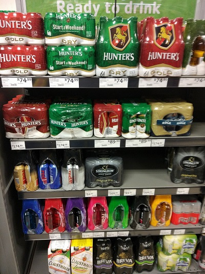
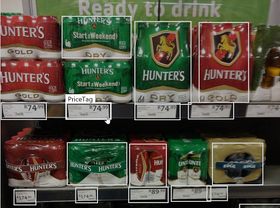

# Price tag OCR

Project to allow extracting the price tags from a picture in a store. In a second step, the images of the price tags are then OCRed.

Example picture:

The project makes use of the following Microsoft Cognitive Services:
* [Custom Vision - Object Detection](https://docs.microsoft.com/en-us/azure/cognitive-services/custom-vision-service/csharp-tutorial-od)
* [Computer Vision](https://docs.microsoft.com/en-us/azure/cognitive-services/Computer-vision/quickstarts/csharp-print-text)

## Prerequisites

### Custom Vision Object Detection
Create a [Custom Vision Object Detection](https://docs.microsoft.com/en-us/azure/cognitive-services/custom-vision-service/csharp-tutorial-od) project. Add training images and tag the price tags using 'Tag' as the tag name.

### Cognitive Services Computer Vision
Create an instance of [Cognitive Services Computer Vision](https://azure.microsoft.com/en-us/try/cognitive-services/my-apis/?api=computer-vision) in the [Azure Portal](https://portal.azure.com).

